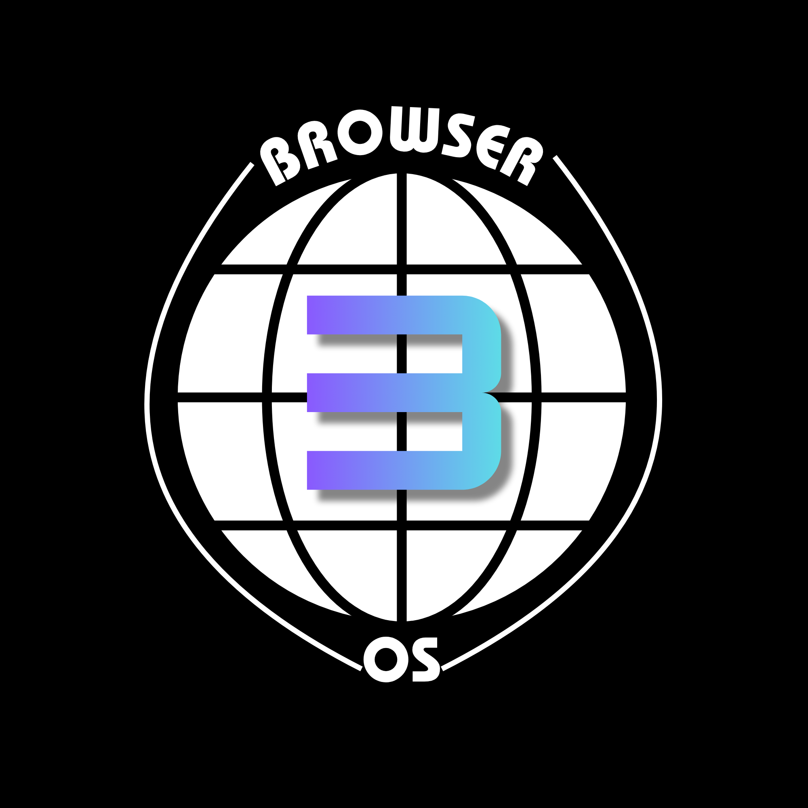

# BrowserOS 3 ALPHA

**Your desktop, in a browser tab.** BrowserOS is a playful, browser-based desktop environment with windows, apps, a taskbar, a Start menu, and a virtual filesystem of its own.

[Open BrowserOS 3](https://jg-tech-aosp.github.io/browseros3dev/) · [Technical specification](SPEC.md)

## What you can do

- **Work with your own files.** Import files into BrowserOS and organize them in Desktop, Documents, Pictures, Music, Downloads, and Apps.
- **Use desktop apps.** File Manager, Browser, Text Editor, Terminal, Settings, App Store, Paint, Image Viewer, Music Player, System Monitor, Calculator, and Markdown Viewer are included.
- **Make it yours.** Choose light or dark mode, set an accent color, and use an image from Pictures as your wallpaper.
- **Move files around.** Drag files between File Manager and the Desktop. Folder moves are checked to prevent moving a folder inside itself, and duplicate filenames get a numbered suffix instead of replacing the original.
- **Install more apps.** The App Store installs `.beep` packages and checks catalog versions for updates. Current highlights include Writer, Snake, BrowserBricks, Stage, and Clock.
- **Keep app data.** Files and settings persist in this browser. Sandboxed apps can use private per-app storage where supported.

## Get started

1. Open [BrowserOS](https://jg-tech-aosp.github.io/browseros/) in a modern browser.
2. Click the BrowserOS logo on the taskbar to open Start, or press **Ctrl + Space** to search apps, recent files, and settings.
3. Open **File Manager** and use **Import** to copy files from your computer into the BrowserOS filesystem.
4. Open **Settings** to change the theme or choose a wallpaper from Pictures.
5. Open **App Store** to browse and install additional `.beep` apps.

BrowserOS runs as a website; there is no desktop installer. A current browser with JavaScript and IndexedDB enabled is required.

## Your files and privacy

BrowserOS stores its virtual files, settings, installed apps, and supported app data in browser storage for this site. This data stays in the current browser profile; it is not automatically uploaded or synced between devices. Clearing the site’s browser data can erase it, so export important files before doing that.

Installable `.beep` apps run in sandboxed frames and request specific permissions. Review app permissions before installing. BrowserOS is an experimental web desktop, not a replacement for your computer’s operating system or a whole-device antivirus.

## Apps and security

BrowserOS includes native system apps as well as bundled `.beep` apps such as Calculator, Markdown Viewer, and Info. Additional apps can be installed from the App Store. The system checks app package versions against the catalog and can keep private data separated by app.

## For contributors

BrowserOS is built with browser-native web technologies and served as a static site. The repository contains the application source, bundled apps, and [SPEC.md](SPEC.md), which documents the implementation and technical design. There is no build step; serve the repository over HTTP to run a local copy so its JavaScript modules and package files load correctly.

See [LICENSE](LICENSE) for license terms.

